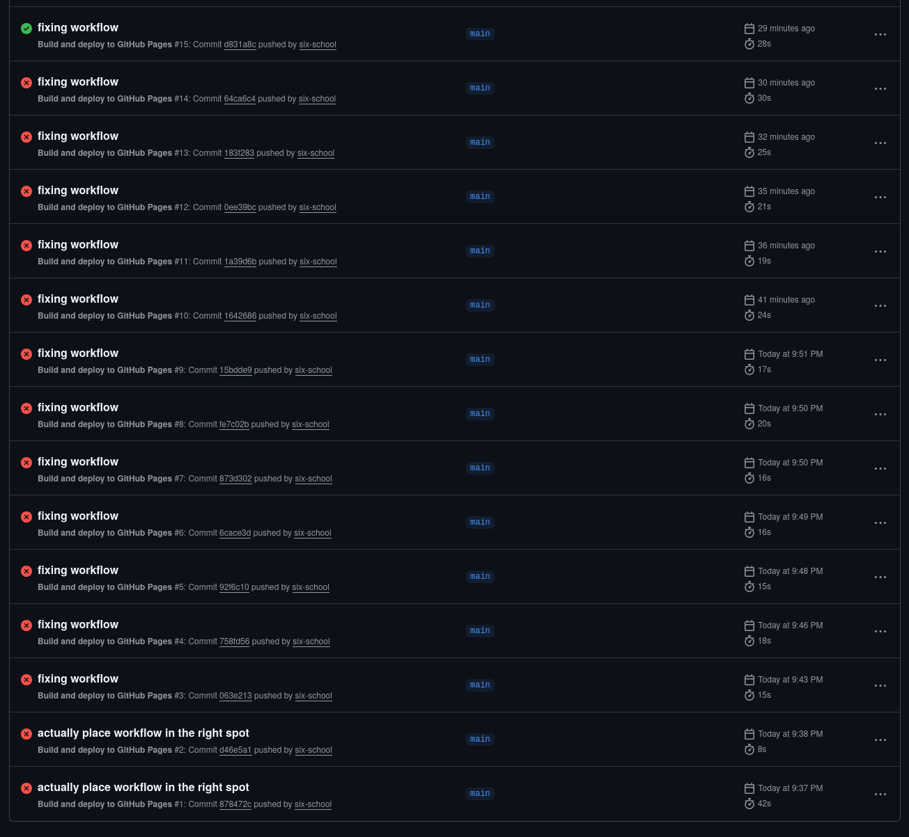

# Prototype 1: Pong

## 2026-09-17

Implemented Pong in class. Vadim seemed a little skeptical when I said I didn't want to use Unity, but eventually assented. I started out in Godot, but after a few minutes I realized it felt like major overkill. (As much as I want to like it, in some ways it's even clunkier than Unity has become...)

I cast about in my projects folder for an alternative and saw a prototype I made this summer using [Usagi](https://usagiengine.com/), a pleasant little game engine that's a bit like a cross between Love2D (or maybe p5) and a fantasy console like PICO-8. It lacks the integrated toolset of the latter (though it includes a [few debugging helpers](https://usagiengine.com/#tools)), but it does have some really nice features like hot-reloading, easy builds for every platform (including web), built-in save games, and control remapping. And unlike PICO-8, it doesn't impose artificial constraints on the number of tokens your game can use — the constraints come more at the level of the API, colour palette, etc.

It went pretty well, and the whole implementation is [about 150 lines](https://github.com/six-school/cart315/blob/d02d764c76da9de7410684e48b5906fd0d024a36/prototype_1_pong/src/main.ts) of not-especially-well-commented code.

After that, I tried to set up a GitHub Actions workflow to build and push the web version to GitHub Pages after every push. There's not really any way to test workflow files locally, so debugging can be fun:

|  |
|:--:|
|GitHub Actions more or less does the job, usually, eventually. Just don't ask [how it works under the hood](https://nesbitt.io/2025/12/06/github-actions-package-manager.html).|

In the interests of not polluting my Git log, I force-pushed my way around the errors. Eventually it worked! You can play my boring version 1 Pong [here](https://six-school.github.io/cart315/). The only other thing I'd like to add is sound — could be a nice element to play with.

  
Nerdy aside

  I think I smoothed out most of the serious bugs, but I saw one funny and vaguely unfixable one: my computer janked up for a second right as the ball was approaching one of the paddles, and the game dropped a few frames... at precisely the right time to cause the ball to phase right through the other side of the paddle. Usagi doesn't have any built-in collision detection (besides an AABB helper you can use for per-frame checks), so if you want continuous collision detection I guess you have to implement it yourself. And I guess it doesn't have a cap on maximum frame time either. Definitely not a problem for a Pong prototype, but maybe I should open an issue in the Usagi repo?

One thought I had: if we're doing MDM, it might be nice to make historic commits playable alongside the current build? With Usagi, the game itself is a hot-swappable `.usagi` file (which currently sits at a few kilobytes) separate from the WASM game engine and HTML page. Since I've already set CI up to make builds, maybe I could upload them as GitHub "releases" or ["artifacts,"](https://docs.github.com/en/actions/concepts/workflows-and-actions/workflow-artifacts) and add a little dropdown in the browser to choose between them? I really like the idea of a playable thing that lives side-by-side a view of the code, with the ability to watch the evolution of both on the spot via a timeline. It might only work for compact games, but Pong is nothing if not compact...

I probably shouldn't get _too_ ambitious for a first class project. And I haven't even written anything about design here — I've got a few little ideas percolating, but we'll see.

## 2026-09-19

Some silly Pong ideas:

- RPG Pong: when your paddle hits the ball there's a Dragon Quest-style RPG battle. Draw out the boredom of waiting for your turn at the ball in Pong by making it even slower!
- Kuleshov Pong: gameplay is occasionally interrupted by images (person's face, coffin, Titanic sinking, etc.) to create a juxtaposition that (maybe) imparts more meaning on the moment
- Paddleball Pong: you have a second ball attached to your paddle by a string that you can swing around while you're waiting for the ball to come to you to alleviate your boredom
- Omelas Pong: the ball is the Omelas child?? Ticker text narrating the suffering of the child and the prosperity of Omelas??

Okay look I'm not saying these are all _good_ ideas, but...

